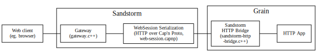
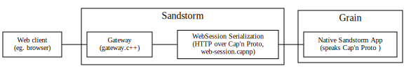

# How It Works

* Sandstorm's server-side sandboxing is based on the same underlying Linux kernel features as LXC and Docker.  We use the system calls directly for finer-grained control.
* The kernel attack surface is reduced using seccomp-bpf to block system calls.
* procfs, sysfs, etc. are not mounted in the sandbox, and only a minimal set of devices are available.
* (Planned) On the client side, apps run in a sandboxed iframe employing the `Content-Security-Policy` header to prevent them from sending any kind of network communication to any server other than their own.
* All communication between the sandboxed server and the outside world takes place through a single [Cap'n Proto](http://capnproto.org) RPC socket which the app's root process receives as file descriptor #3.  We've provided a program, `sandstorm-http-bridge`, which can receive HTTP-over-RPC requests on this socket and proxy them to a regular HTTP server running in the sandbox.
* Every object (e.g., each document) that you create with an application runs in a separate isolated sandbox.  We sandbox per-object rather than per-app so that it is easy and safe to share one object without also sharing everything created using the same app.
* An application package (`.spk` file) is essentially an archive containing an entire chroot environment in which the application runs.
* The application runs with the contents of its package mounted read-only, so that multiple instances of the same app can share disk space for the package.
* The application may store persistent state in the `/var` directory.
* App servers are aggressively killed off as soon as the user closes the browser tab, then restarted when the user returns later.
* Packages are cryptographically signed.  Packages signed with the same key represent versions of the same app, and are thus allowed to replace older versions -- although the user must still confirm these upgrades.

To read more about how Sandstorm works from an system administrator's perspective, see the
[Sandstorm administrator's guide.](../administering/guide.md)

## HTTP Communication Overview

While web clients speak HTTP to Sandstorm, all communications between Sandstorm
and the grain occur over the Cap'n Proto WebSession format.  With existing
applications, the Sandstorm HTTP bridge is used to translate between Cap'n
Proto and HTTP.

<!--
graphviz dot communication_overview_http_app.svg
    graph communication_overview_http_app {
      rankdir=LR;
      compound=true;
      node [shape=box fontsize=10];

      client [label="Web client\n(eg. browser)"];

      subgraph cluster_sandstorm {
        label="Sandstorm";
        proxy [label="Gateway\n (gateway.c++)";];
        websession [label="WebSession Serialization\n(HTTP over Cap'n Proto,\nweb-session.capnp)"];
      }

      subgraph cluster_grain {
        label="Grain";
        bridge [label="Sandstorm\nHTTP Bridge\n(sandstorm-http\n-bridge.c++)"]
        app [label="HTTP App"];
      }

      client -- proxy;
      proxy -- websession;
      websession -- bridge;
      bridge -- app;
    }
-->

When an application can speak Cap'n Proto directly to Sandstorm, the HTTP
bridge is not needed.

<!--
graphviz dot communication_overview_native_app.svg
    graph communication_overview_native_app {
      rankdir=LR;
      compound=true;
      node [shape=box fontsize=10];

      client [label="Web client\n(eg. browser)"];

      subgraph cluster_sandstorm {
        label="Sandstorm";
        proxy [label="Gateway\n (gateway.c++)";];
        websession [label="WebSession Serialization\n(HTTP over Cap'n Proto,\nweb-session.capnp)"];
      }

      subgraph cluster_grain {
        label="Grain";
        app [label="Native Sandstorm App\n(speaks Cap'n Proto )"];
      }

      client -- proxy;
      proxy -- websession;
      websession -- app;
    }
-->
